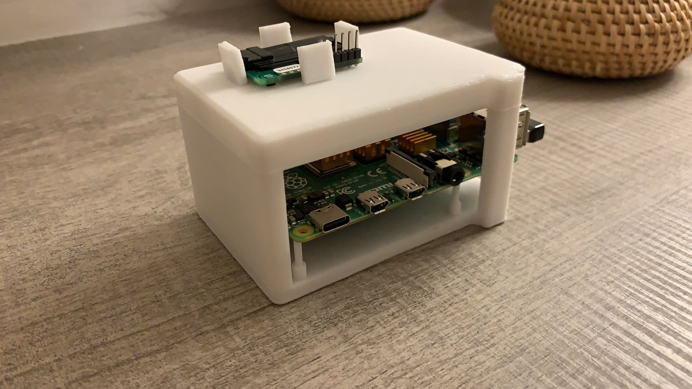
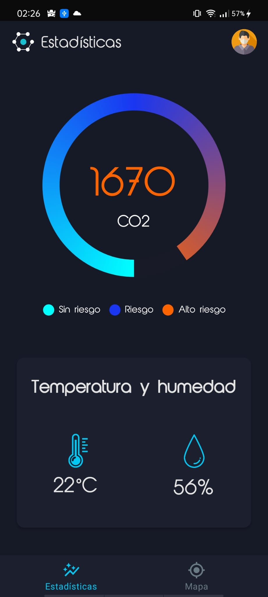
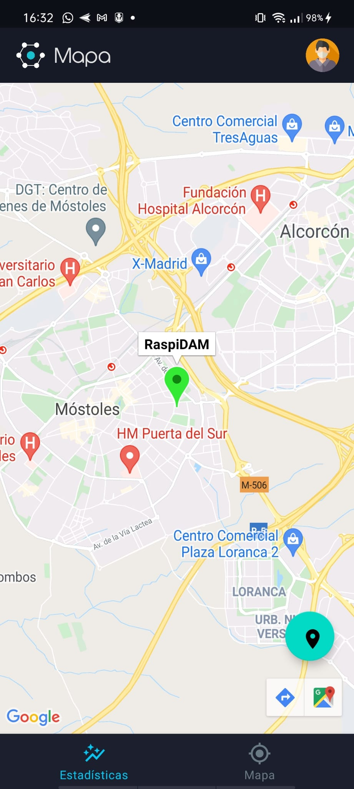

# DryIce

> Proyecto de Fin de Ciclo, Universidad Europea de Madrid, 2021

DryIce es un proyecto de IOT con un que tiene como objetivo detectar la calidad del aire.

Con ello, conseguiremos que, en lugares cómo colegios o universidades, se sepa cuando es necesario ventilar el espacio en el que nos encontramos y asi evitar contagios de virus o particulas malignas que puedan estar en el entorno.

Para ello, utilizamos una Raspberry Pi y un sensor de CO2, temperatura y humedad, en el cual registramos los datos y los subimos a una base de datos a tiempo real. Esos datos de la base de datos a tiempo real los vamos a pasar a una aplicacion que hemos creado para que el usuario los pueda ver y analizar.

Para tener guardada la Raspberry y el Sensor, hemos diseñado una caja y la hemos impreso en 3D.

Esto son unas imagenes de lo que muestra la aplicacion y de la Raspberry con el sensor y la caja.

|  Graficas con los datos  |  Mapa con datos  |
|--------------------------|:----------------:|
|    | |
